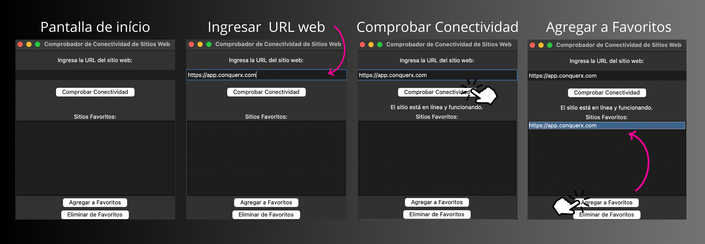

# 🇺🇸 Website Connectivity Checker 🌐

Welcome to the project page of the Website Connectivity Checker! This program allows you to verify the connectivity of a website and manage your favorite sites.

## Screenshots 📷

   

## Project Description 📝

This project is developed in Python using the `tkinter` library to create a simple graphical interface. It enables users to perform the following actions:

- Enter a URL and check its connectivity.
- Add websites to their favorites list.
- Remove websites from their favorites list.
- Load and save the favorites list to a JSON file.

## How to Use 🚀

1. Clone or download this repository to your local machine.
2. Run the `main.py` file to start the application.

## Requirements 🛠️

Ensure you have Python 3 installed on your system. Additionally, this project uses the following external libraries:

- `tkinter` (included in Python's standard library)

## How Web Checking Works 🌐

The Website Connectivity Checker uses Python's `urllib` library to check the connectivity of a website entered by the user. Here's how it works:

1. **Enter a URL:** The user enters a URL in the text box and clicks the "Check Connectivity" button 📩.

2. **Validate the URL:** The `is_valid_url(url)` function 👷‍♀️ checks if the entered URL has the correct format using a regular expression.

3. **Connect to the URL:** If the URL is valid, the program attempts to connect to the URL using `urlopen(url)` 🌐.

4. **Check the Status Code:** The response's status code is verified. If the code is 200, the site is considered online and functioning ✅. If the code is not 200, a message with the status code is displayed ❌.

5. **Show Results:** The check result is displayed on the graphical interface 🖥️, indicating whether the site is online, and if not, it provides information about the connection error 🚫.

## Key Program Functions 🛠️

The program consists of several key functions that enable specific actions:

- `is_valid_url(url)`: Validates if a URL has the correct format ✅.
- `check_connectivity()`: Performs the connectivity check of the entered URL 🌐.
- `add_to_favorites()`: Adds a URL to the favorites list 📌.
- `remove_from_favorites()`: Removes a URL from the favorites list 🗑️.
- `save_favorites()`: Saves the favorites list to a JSON file 💾.
- `load_favorites()`: Loads the favorites list from a JSON file 📂.

These functions allow users to check website connectivity, manage their favorites list, and keep their information saved for future sessions 🤗.

## Contributions 🤝

Contributions are welcome! If you wish to contribute to this project, please:

1. Fork the repository.
2. Create a new branch for your changes (`git checkout -b feature/new-feature`).
3. Make your modifications and ensure the changes are functional.
4. Commit your changes (`git commit -m 'Added new feature'`).
5. Push your changes to your GitHub repository (`git push origin feature/new-feature`).
6. Create a pull request to this main repository.

## Author 👤

**Ferran226** 🚀

- GitHub: [Ferran226](https://github.com/Ferran226)
- Email: [ferrancolllopez@gmail.com](mailto:ferrancolllopez@gmail.com)

## License 📜

This project is under the MIT License - see the [LICENSE.md](LICENSE) file for more details.

Thank you for using the Website Connectivity Checker! If you have any questions or suggestions, don't hesitate to [contact us](mailto:ferrancolllopez@gmail.com) 📧.

---

# 🇪🇸 Comprobador de Conectividad de Sitios Web 🌐

¡Bienvenido a la página del proyecto de Comprobador de Conectividad de Sitios Web! Este programa te permite verificar la conectividad de un sitio web y administrar tus sitios favoritos.

## Capturas de Pantalla del Funcionamiento 📷

   

## Descripción del Proyecto 📝

Este proyecto está desarrollado en Python utilizando la biblioteca `tkinter` para crear una interfaz gráfica simple. Permite a los usuarios realizar las siguientes acciones:

- Ingresar una URL y comprobar su conectividad.
- Agregar sitios web a su lista de favoritos.
- Eliminar sitios web de su lista de favoritos.
- Cargar y guardar la lista de favoritos en un archivo JSON.

## Cómo Usar 🚀

1. Clona o descarga este repositorio en tu máquina local.
2. Ejecuta el archivo `main.py` para iniciar la aplicación.

## Requisitos 🛠️

Asegúrate de tener Python 3 instalado en tu sistema. Además, este proyecto utiliza las siguientes bibliotecas externas:

- `tkinter` (incluida en la biblioteca estándar de Python)

## Cómo se Realiza la Comprobación Web 🌐

El Comprobador de Conectividad de Sitios Web utiliza la biblioteca `urllib` de Python para comprobar la conectividad de un sitio web ingresado por el usuario. Aquí se explica cómo funciona:

1. **Ingresar una URL:** El usuario ingresa una URL en la casilla de texto y hace clic en el botón "Comprobar Conectividad" 📩.

2. **Verificar la URL:** La función `is_valid_url(url)` 👷‍♀️ comprueba si la URL ingresada tiene el formato correcto utilizando una expresión regular.

3. **Conexión a la URL:** Si la URL es válida, el programa intenta conectarse a la URL utilizando `urlopen(url)` 🌐.

4. **Comprobar el Código de Estado:** Se verifica el código de estado de la respuesta. Si el código es 200, se considera que el sitio está en línea y funcionando ✅. Si el código es diferente de 200, se muestra un mensaje con el código de estado ❌.

5. **Mostrar Resultados:** El resultado de la comprobación se muestra en la interfaz gráfica 🖥️, indicando si el sitio está en línea y, en caso contrario, se proporciona información sobre el error de conexión 🚫.

## Funciones Clave del Programa 🛠️

El programa consta de varias funciones clave que permiten realizar acciones específicas:

- `is_valid_url(url)`: Verifica si una URL tiene el formato correcto ✅.
- `check_connectivity()`: Realiza la comprobación de conectividad de la URL ingresada 🌐.
- `add_to_favorites()`: Agrega una URL a la lista de favoritos 📌.
- `remove_from_favorites()`: Elimina una URL de la lista de favoritos 🗑️.
- `save_favorites()`: Guarda la lista de favoritos en un archivo JSON 💾.
- `load_favorites()`: Carga la lista de favoritos desde un archivo JSON 📂.

Estas funciones permiten a los usuarios verificar la conectividad de sitios web, administrar su lista de favoritos y mantener su información guardada para futuras sesiones 🤗.

## Contribuciones 🤝

¡Las contribuciones son bienvenidas! Si deseas contribuir a este proyecto, por favor:

1. Realiza un fork del repositorio.
2. Crea una nueva rama para tus cambios (`git checkout -b feature/nueva-funcionalidad`).
3. Realiza tus modificaciones y asegúrate de que los cambios sean funcionales.
4. Haz un commit de tus cambios (`git commit -m 'Agregada nueva funcionalidad'`).
5. Envía tus cambios a tu repositorio en GitHub (`git push origin feature/nueva-funcionalidad`).
6. Crea una solicitud de extracción (pull request) a este repositorio principal.

## Autor 👤

**Ferran226** 🚀

- GitHub: [Ferran226](https://github.com/Ferran226)
- Correo Electrónico: [ferrancolllopez@gmail.com](mailto:ferrancolllopez@gmail.com)

## Licencia 📜

Este proyecto está bajo la Licencia MIT - consulta el archivo [LICENSE.md](LICENSE) para más detalles.

---

¡Gracias por usar el Comprobador de Conectividad de Sitios Web! Si tienes alguna pregunta o sugerencia, no dudes en [contactarnos](mailto:ferrancolllopez@gmail.com) 📧.
