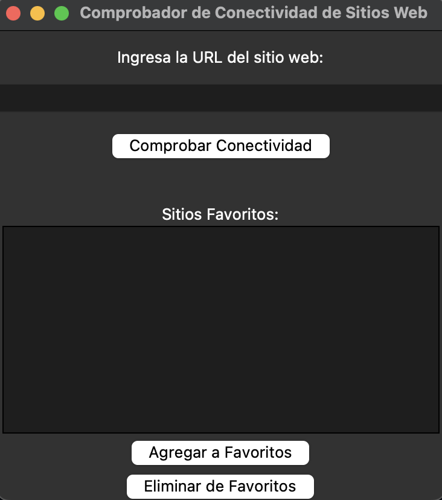
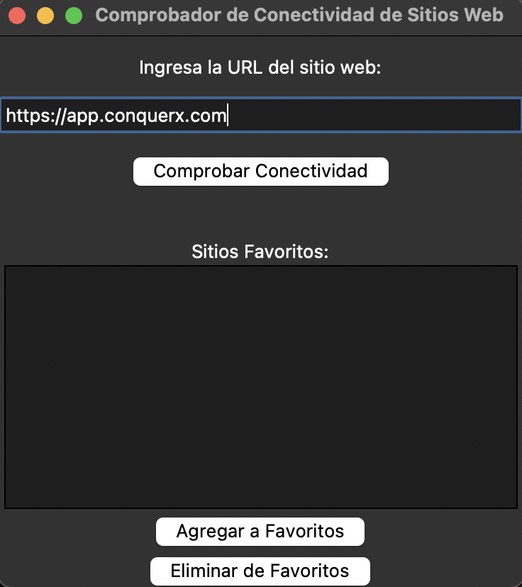
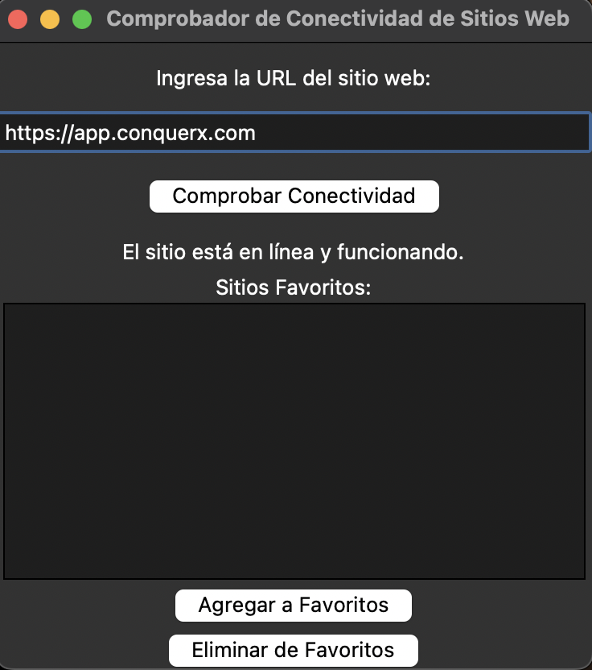

# Comprobador de Conectividad de Sitios Web 🌐

¡Bienvenido a la página del proyecto de Comprobador de Conectividad de Sitios Web! Este programa te permite verificar la conectividad de un sitio web y administrar tus sitios favoritos.

## Capturas de Pantalla 📷

1. **Pantalla de Inicio:**

   

2. **Ejemplo de URL:**

   

3. **Conectividad:**

   

4. **Agregar a Favoritos:**

   

## Descripción del Proyecto 📝

Este proyecto está desarrollado en Python utilizando la biblioteca `tkinter` para crear una interfaz gráfica simple. Permite a los usuarios realizar las siguientes acciones:

- Ingresar una URL y comprobar su conectividad.
- Agregar sitios web a su lista de favoritos.
- Eliminar sitios web de su lista de favoritos.
- Cargar y guardar la lista de favoritos en un archivo JSON.

## Cómo Usar 🚀

1. Clona o descarga este repositorio en tu máquina local.
2. Ejecuta el archivo `main.py` para iniciar la aplicación.

## Requisitos 🛠️

Asegúrate de tener Python 3 instalado en tu sistema. Además, este proyecto utiliza las siguientes bibliotecas externas:

- `tkinter` (incluida en la biblioteca estándar de Python)

## Cómo se Realiza la Comprobación Web 🌐

El Comprobador de Conectividad de Sitios Web utiliza la biblioteca `urllib` de Python para comprobar la conectividad de un sitio web ingresado por el usuario. Aquí se explica cómo funciona:

1. **Ingresar una URL:** El usuario ingresa una URL en la casilla de texto y hace clic en el botón "Comprobar Conectividad" 📩.

2. **Verificar la URL:** La función `is_valid_url(url)` 👷‍♀️ comprueba si la URL ingresada tiene el formato correcto utilizando una expresión regular.

3. **Conexión a la URL:** Si la URL es válida, el programa intenta conectarse a la URL utilizando `urlopen(url)` 🌐.

4. **Comprobar el Código de Estado:** Se verifica el código de estado de la respuesta. Si el código es 200, se considera que el sitio está en línea y funcionando ✅. Si el código es diferente de 200, se muestra un mensaje con el código de estado ❌.

5. **Mostrar Resultados:** El resultado de la comprobación se muestra en la interfaz gráfica 🖥️, indicando si el sitio está en línea y, en caso contrario, se proporciona información sobre el error de conexión 🚫.

## Funciones Clave del Programa 🛠️

El programa consta de varias funciones clave que permiten realizar acciones específicas:

- `is_valid_url(url)`: Verifica si una URL tiene el formato correcto ✅.
- `check_connectivity()`: Realiza la comprobación de conectividad de la URL ingresada 🌐.
- `add_to_favorites()`: Agrega una URL a la lista de favoritos 📌.
- `remove_from_favorites()`: Elimina una URL de la lista de favoritos 🗑️.
- `save_favorites()`: Guarda la lista de favoritos en un archivo JSON 💾.
- `load_favorites()`: Carga la lista de favoritos desde un archivo JSON 📂.

Estas funciones permiten a los usuarios verificar la conectividad de sitios web, administrar su lista de favoritos y mantener su información guardada para futuras sesiones 🤗.

## Contribuciones 🤝

¡Las contribuciones son bienvenidas! Si deseas contribuir a este proyecto, por favor:

1. Realiza un fork del repositorio.
2. Crea una nueva rama para tus cambios (`git checkout -b feature/nueva-funcionalidad`).
3. Realiza tus modificaciones y asegúrate de que los cambios sean funcionales.
4. Haz un commit de tus cambios (`git commit -m 'Agregada nueva funcionalidad'`).
5. Envía tus cambios a tu repositorio en GitHub (`git push origin feature/nueva-funcionalidad`).
6. Crea una solicitud de extracción (pull request) a este repositorio principal.

## Autor 👤

**Ferran226** 🚀

- GitHub: [Ferran226](https://github.com/Ferran226)
- Correo Electrónico: [ferrancolllopez@gmail.com](mailto:ferrancolllopez@gmail.com)

## Licencia 📜

Este proyecto está bajo la Licencia MIT - consulta el archivo [LICENSE.md](LICENSE.md) para más detalles.

---

¡Gracias por usar el Comprobador de Conectividad de Sitios Web! Si tienes alguna pregunta o sugerencia, no dudes en [contactarnos](mailto:ferrancolllopez@gmail.com) 📧.
